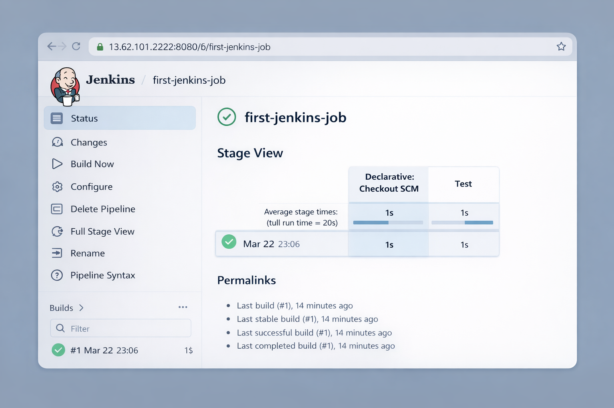
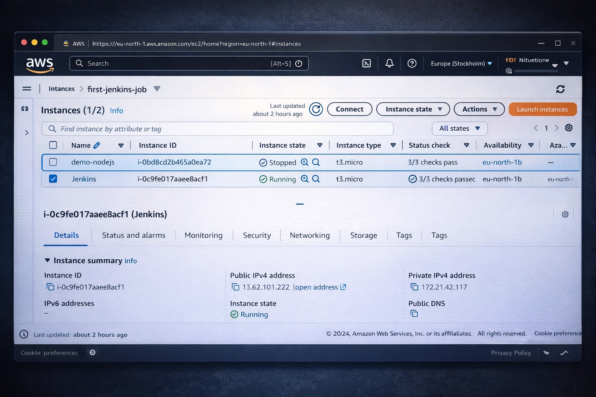

🚀 CI/CD Pipeline using Jenkins, Docker & AWS

📌 Project Overview

This project demonstrates a complete CI/CD pipeline using Jenkins, Docker, and AWS EC2.
It automates building, testing, and deploying a Spring Boot application using Kubernetes manifests.

---

🛠️ Tech Stack

- Jenkins (CI/CD)
- Docker (Containerization)
- AWS EC2 (Cloud Deployment)
- Git & GitHub (Version Control)
- Spring Boot (Backend Application)
- Kubernetes YAML (Deployment)

---

⚙️ Pipeline Workflow

1. Code pushed to GitHub
2. Jenkins triggers pipeline
3. Build using Maven
4. Docker image creation
5. Docker container deployment on EC2
6. Kubernetes manifests used for deployment

---

📂 Project Structure

cicd-jenkins-docker/
│── spring-boot-app/                # Spring Boot source code
│── spring-boot-app-manifests/      # Kubernetes YAML files
│   ├── deployment.yml
│   └── service.yml
│── Jenkinsfile                     # CI/CD pipeline
│── README.md

---

🚀 How to Run

1️⃣ Clone Repository

git clone https://github.com/your-username/cicd-jenkins-docker.git
cd cicd-jenkins-docker

2️⃣ Setup Jenkins on AWS

- Launch EC2 instance
- Install Jenkins & Docker
- Configure GitHub credentials

3️⃣ Run Pipeline

- Open Jenkins dashboard
- Click Build Now
- Pipeline will execute automatically

---

🌐 Deployment Details

- Jenkins hosted on AWS EC2
- Docker containers run on EC2
- Kubernetes YAML used for deployment configuration

---

💡 Key Features

✔ Automated CI/CD pipeline
✔ Docker-based deployment
✔ AWS cloud integration
✔ Kubernetes-ready configuration
✔ End-to-end DevOps workflow

---

🔮 Future Improvements

- Integrate Helm for better deployment management
- Add ArgoCD for GitOps workflow
- Integrate SonarQube for code quality

---

🧠 Learning Outcome

- Hands-on CI/CD pipeline creation
- Jenkins & GitHub integration
- Docker containerization
- AWS EC2 deployment
- Kubernetes basics

---

🔗 Author

Nishant Kumar
📧 itsnishantkr18@gmail.com
---

## 📸 Project Screenshots

### 🔹 Jenkins Dashboard

### 🔹 First Dashboard

### 🔹 AWS EC2 Instance

### 🔹 Final Success Build

⭐ If you like this project, give it a star!
